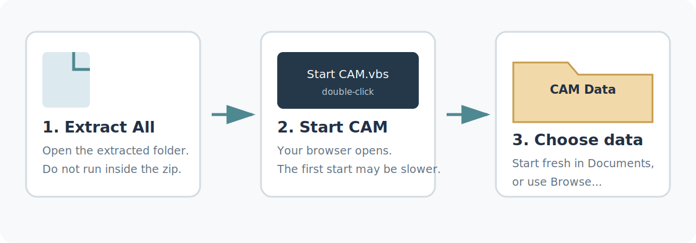
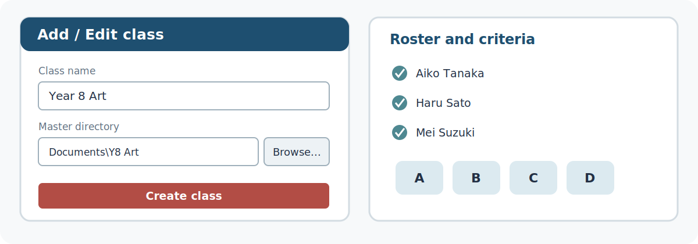
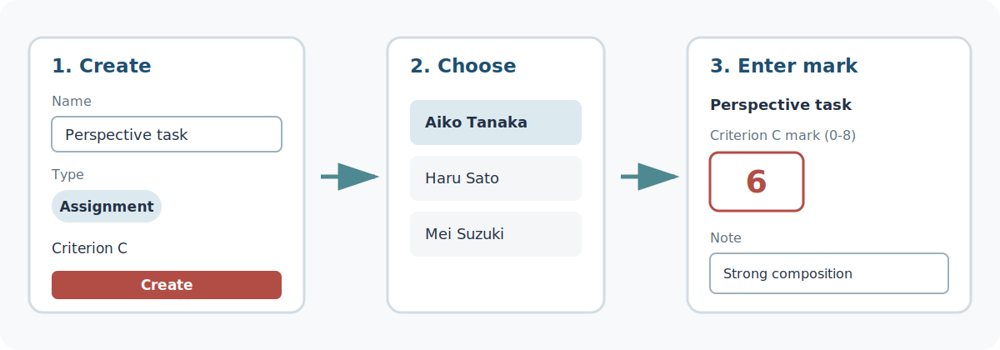
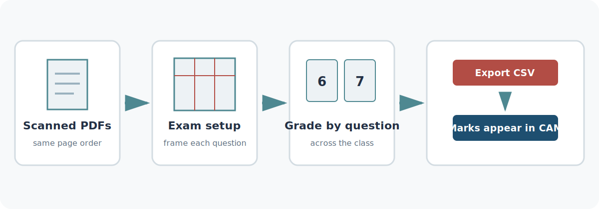
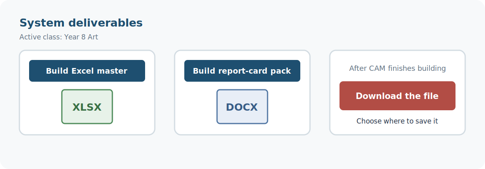
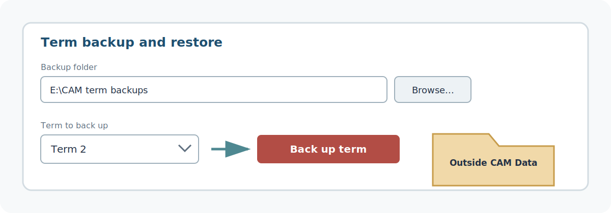
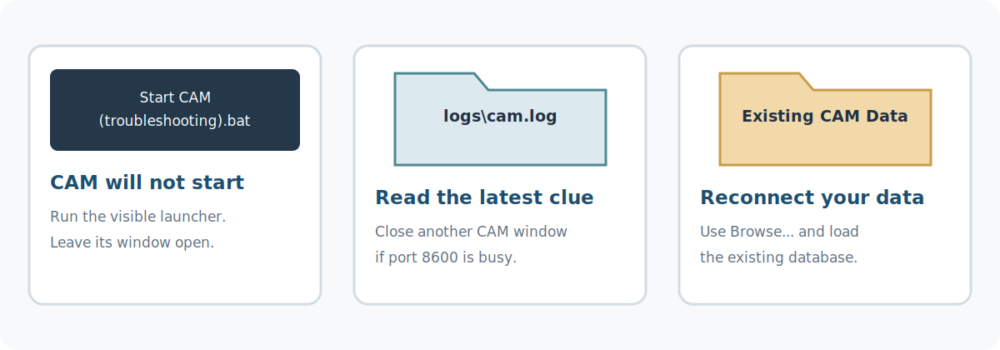

# CAM Quick Guide

## Get started

1. Right-click the downloaded CAM zip, choose **Extract All**, and open the new folder. Don't run CAM from inside the zip — it can't save anything there.
2. Double-click **Start CAM.vbs**. Your browser opens by itself; the very first start takes a little longer.
3. The welcome screen asks where your gradebook should live — you answer once per computer:
   - Already have a CAM gradebook? CAM looks through your OneDrive / Google Drive / Dropbox folders and lists what it finds — click **Use this** beside yours (the class and student counts help you recognise it).
   - Want a particular folder — a USB drive, a network share, a new cloud folder? Click **📁 Browse…**, pick it, then **Use this folder**.
   - New to CAM? Click **Start fresh with sample data** and your gradebook is created in `Documents\CAM Data`.

### Good to know

- The app folder and your data folder are deliberately separate: to update CAM you just replace the app folder, and your gradebook is untouched.
- A cloud-synced data folder (OneDrive / Google Drive) means every computer you use shares the same gradebook — and it's backed up without you doing anything.
- The sample class is entirely fictional, so explore freely — nothing you try can affect real students.

> Choosing a folder never overwrites anything: an existing database there is loaded, and an empty folder simply gets a new one on first save.

## Set up a class

CAM lays the whole job out in three windows, read left to right in the order you work: **Window 1 · Classes & Assignments**, **Window 2 · Students & Evidence**, **Window 3 · Report & Comment** — pick the work, score it, write the report.

1. In the top bar, click **✎ Add / Edit class**, then **➕ Add a class**.
2. Name the class, and add the grade, MYP year and subject if you use them.
3. **Master directory** is optional — click **📁 Browse…** and pick the local folder that will hold this class's assignment folders, or paste a Google Drive folder ID if the class syncs from Drive.
4. Click **Create class**.
5. In Window 2, add students with **➕ Add student** or import a whole roster file. Check each student's name and email before grading — imported scores are matched to students by them.

### Good to know

- Criteria A–D are already built in. You choose the criterion when you create each assignment, and every score that feeds a grade stays visible in Window 2.
- The gender field is optional and does exactly one thing: it sets the pronouns used in that student's report comment.
- Column widths and panel heights are draggable, and your layout is remembered on this device only.

> Nothing set here is permanent — reopen **✎ Add / Edit class** any time to rename the class or change its details.

## Add an assignment and enter marks

1. Choose the class and term in the top bar.
2. In Window 1, click **➕ Add assignment / exam**.
3. Enter a name and date, keep **Assignment** selected, pick criterion A, B, C or D, then click **Create**.
4. Click a student in Window 2. In Window 3, find the new assignment and enter a mark from 0 to 8 — with a short note if it's worth remembering why.
5. Work through the class. CAM writes every change into your gradebook as you go; **💾 Save now** is there for reassurance, not because you have to press it.

### Good to know

- Typing marks isn't the only way in: Window 1 can import a grade CSV, or watch a folder and ingest new files by itself — scores are matched to students and dated automatically.
- In Window 2 you can exclude a piece that shouldn't count, flag a wrong-assignment upload, or mark work late — the evidence stays visible, and nothing is deleted.
- The weighting method in Window 2 (for example "60/40 Recency") decides how strongly recent work pulls each criterion's suggested grade.

> A new assignment shows as missing for everyone until you enter a mark or switch the assignment off for that student.

## Grade an exam

1. In Window 1, create the item with **➕ Add assignment / exam** and mark it as an **Exam**, then click its **🛠 Exam setup** button to open the grading workspace.
2. Point the folder field at your scanned PDFs, frame each question against the on-page grid, and type each question's **Max mark**. Add a **Name box** over where students write their name — it pays off later.
3. Click **💾 Save Setup**, then **⚙ Process All PDFs**: every script is sliced into one answer image per question.
4. Grade one question at a time across the whole class. Tick keyword pills for stock feedback and add comments where they help — totals are hidden on purpose, so you mark the answer in front of you, not a running score.
5. Click **Export CSV**. CAM ingests it automatically, and Window 1's **📝 Exam grading** panel turns each raw total into the 0–8 criterion grade — CAM suggests, you decide.

### Good to know

- A crop cutting off an answer isn't a disaster: click the ✎ beside that question, widen its box, and **⚙ Re-slice this question** — every mark you've already entered stays put.
- **Anonymous grading** (in the workspace settings) hides names and shows papers by position, re-shuffled for every question, so no impression of any one student builds up.
- If you framed a name box, naming the students at setup means the exported CSV arrives already matched to your roster.

> Scan every paper in the same page order. If CAM warns that one script has a different page count, re-scan it before grading — its crops would land on the wrong answers.

## Reports and exports

1. Choose the class and term you're reporting on.
2. In Window 3, review each student's final criterion grades and generate the report comment. With no setup, CAM copies a ready-made prompt for you to paste into any chatbot; add a Claude or Gemini API key in the comment settings and it writes the comment in place.
3. Scroll to **System deliverables**.
4. Click **Build Excel master** for the multi-tab grade workbook, or **Build report-card pack** for one document with a page per student — marks, progression graph, final grades and comment.
5. When the download button appears, click it and save the file. Select one student first if you only need that student's report.

### Good to know

- Exports cover the active class only — switch class in the top bar and build again for the next one.
- If your school reports banded grades on top of the criteria, switch them on in **⚙ Settings → Report-card grades**: MYP Grade (1–7), Effort / English-use and School Grade (1–10) are all off by default, and appear in Window 3 and the reports once enabled.
- Files still sitting in staging pause the export buttons — commit them first.

> A generated comment is a first draft built from your grades. Always read and adjust it before it goes on a report.

## Back up your term

1. Open **⚙ Settings** and find **🗄 Term backup & restore**.
2. Beside the backup folder, click **📁 Browse…** and choose a folder outside your CAM data folder — a USB stick is ideal for an off-site copy.
3. Choose the term, then click **⬇ Back up term**.
4. Check the success message and confirm the `cam_term_backup_…` file landed in the folder you chose.

### Good to know

- A backup holds everything CAM knows about that term — assignments, grades, exam results, comments and effort scores — and it only ever writes outside your database, so backing up can never harm your live data. Make it an end-of-term habit.
- **⬆ Restore from backup…** is a rescue tool, not an editing tool. It previews exactly what would change, asks you to type a confirmation, and then replaces that whole term — anything you entered after the backup was made is not in the file.
- CAM also keeps automatic `.bak` safety copies beside your database. Leave them alone — they're the last line of defence.

> Keep a second copy somewhere that isn't this computer, and eject a USB drive properly once the backup finishes.

## When something goes wrong

### CAM will not start

Double-click **Start CAM (troubleshooting).bat** instead of the usual launcher. It runs the same CAM with a visible black window — leave it open and read the last message, which usually names the problem. The same details are saved in `logs\cam.log`. If port 8600 is already in use, another CAM is still running: close its window and try again.

### CAM cannot find your gradebook

On the welcome screen, click **📁 Browse…** and choose the folder that contains `acm_database.json`. If CAM is already open, use **⚙ Settings → Custom Database Path** instead. CAM always loads an existing database rather than overwriting it, and shows its class and student counts so you can recognise the right one — never choose Replace unless you truly mean to start over.

### You moved to a new laptop

Extract a fresh CAM bundle on the new machine. If your data folder is cloud-synced, sign in and let it finish syncing; otherwise copy the folder across. Start CAM and point **📁 Browse…** at that folder. Don't copy `local_device_prefs.json` from the old machine — each computer keeps its own paths.

### Your gradebook is damaged

Recover the file first: restore `acm_database.json` from your cloud folder's version history, or from the newest `.bak` copy beside it. If one term's detail is still wrong after that, use **⬆ Restore from backup…** with your end-of-term backup file.

