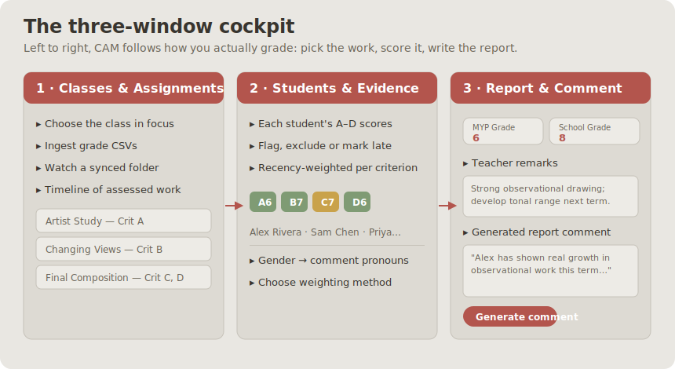
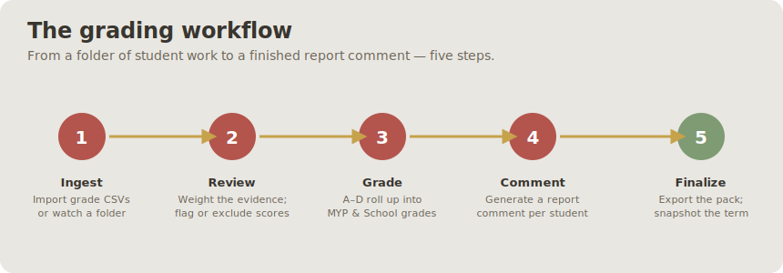
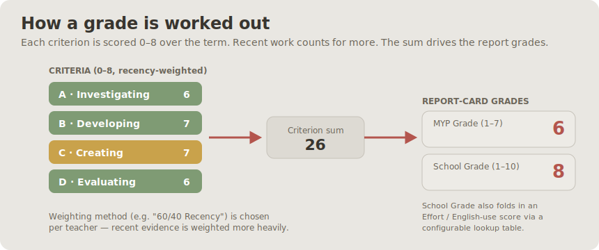

# User manual

A short, illustrated tour of Criterion Assessment Metrics (CAM) for the teacher
using it day to day. If you haven't installed it yet, start with the
[Setup guide](SETUP.md).

For the short, print-friendly walkthrough shipped with the Windows portable
bundle, use the [CAM Quick Guide](QUICK_GUIDE.md). It covers first start, class
setup, marks, exam grading, reports, backups and the two troubleshooting
launchers. This manual provides the fuller explanation behind those tasks.

> Everything shown below runs on the bundled **fictional sample class** — the
> students, grades and comments are invented.

---

## The three-window cockpit

CAM lays the whole grading job out on one screen, in three panels that read left
to right — the same order you actually work in: **pick the work → score it →
write the report.**

| Window | You use it to… |
|---|---|
| **1 · Classes & Assignments** | Switch between the classes you teach, import grade CSVs, watch a synced folder for new work, and see the timeline of assessed assignments. |
| **2 · Students & Evidence** | See every student's Criterion A–D scores, flag or exclude a piece, mark work late, and set the weighting method. Each student's gender (optional) sets the pronouns used in their comment. |
| **3 · Report & Comment** | Read the final criterion grades — plus, if you switch them on in Settings, the school-specific **MYP Grade** / **Effort** / **School Grade** — jot teacher remarks, and generate the report-card comment. |

You can drag the column widths and panel heights to suit your screen; those
preferences are saved to your device only.

---

## The daily workflow

1. **Ingest.** In Window 1, import a grade CSV (or point CAM at a folder it
   watches). Scores are matched to students and dated automatically.
2. **Review.** In Window 2, glance over the evidence. Exclude a piece that
   shouldn't count, flag a "wrong assignment" upload, or mark something late —
   without deleting anything.
3. **Grade.** CAM computes a recency-weighted suggestion for each criterion and
   rolls them into the report grades (see below).
4. **Comment.** In Window 3, generate a report-card comment. With no setup this
   copies a ready-made prompt to your clipboard; with an API key it writes the
   comment in place.
5. **Finalize.** Export the mail-merge pack and snapshot the term so next term's
   comments can build on this one.

---

## How a grade is worked out

Each MYP criterion is scored **0–8**, and a student collects several scores per
criterion across the term. CAM weights **recent** work more heavily and sums the
per-criterion results — that criterion picture is always the core of the grade.

- The **weighting method** (for example *"60/40 Recency"*) is yours to choose in
  Window 2.
- **Optional school-specific roll-ups.** Some schools also report banded grades
  on top of the criteria. These are **off by default**; turn on the ones you use
  in **⚙ Settings → Report-card grades**:
  - **MYP Grade (1–7)** — looked up straight from the criterion sum.
  - **Effort / English-use** — a per-student, per-term score you set (its range
    is configurable in the same settings section).
  - **School Grade (1–10)** — folds the Effort/English-use score in with the
    criterion sum through a lookup table.

  When enabled they appear in Window 3 and in the report cards; when off, CAM
  reports the criterion grades alone.

Nothing here is a black box: every score that feeds a grade is visible in Window
2, and you can exclude or re-weight any of it.

---

## Report-card comments

CAM drafts a comment from the same evidence you can see on screen — it is
pronoun-aware (from the optional gender field) and term-aware (it can build on a
previous term's finalized comment).

- **Clipboard mode (no setup).** CAM assembles the prompt; you paste it into any
  chatbot and paste the result back. Nothing leaves your machine automatically.
- **API mode (optional).** Add a Claude or Gemini API key in the comment
  settings and CAM writes the comment in one click. See
  [Setup · report-comment AI](SETUP.md#6-optional-report-comment-ai).

Always read and adjust a generated comment before it goes on a report — it is a
first draft built from your grades, not a replacement for your judgement.

---

## The grading workspace (optional)

For grading student work that syncs in from Google Drive / OneDrive, CAM can
launch a companion **grading workspace**: a thumbnail grid of a whole class's
submissions, an anonymous grading mode (grade without seeing names to reduce
bias), and PDF exam slicing for marking scanned papers. It hands finished grades
back to the dashboard automatically. Setup is in
[Setup · the grading workspace](SETUP.md#7-optional-the-grading-workspace--google-drive).

---

## Grading exam papers

Marking a scanned paper exam runs end to end through the workspace: you frame
each question once, CAM slices every student's script into per-question answer
images, you grade one question at a time across the whole class, and the totals
land back in the cockpit. This section walks the whole loop.

### 1 · Create the exam in Window 1

In Window 1, use **Add assignment / exam** and mark it as an **exam**. The new
exam appears in the timeline like any assignment, but with a **🛠 Exam setup**
button — click it to open the grading workspace's Exam Setup screen for this
exam.

### 2 · Set up the exam (Exam Setup)

Exam Setup is where you tell CAM what the paper looks like. Left pane: the
scanned page with a grid drawn over it. Right pane: the question list.

- **Load the scans.** Point the folder field at the folder of scanned PDFs (one
  PDF per student, or one multi-page PDF — the workspace handles both). The
  first page renders in the left pane.
- **Grid density.** You frame each question by typing a coordinate range (like
  `A1:C3`) against the grid. Next to **Paper size** the **Grid** control sets how
  fine the grid is: **Compact (≈1.4 cm cells)** is the default and suits most
  papers; **Fine (≈1 cm cells)** lets you frame small answers tightly (its
  columns run past Z into AA, AB, … for the densest pages). Pick the density
  *before* you type the ranges — switching it afterwards re-checks every range
  against the new grid and red-flags any that no longer fit, so you'd re-type
  them. Older exams saved before this option keep their original grid: loading
  one shows a **Standard (legacy 2 cm)** state so its coordinates still line up.
- **Grid colour.** Next to the Grid control is a colour picker — **Neon green**
  (default), **Bright blue**, or **Bright magenta**. It only tints the grid lines
  and cell labels drawn over the page, so pick whichever stands out best against
  the ink and paper you're marking. The choice is remembered on this device.
- **Fit width / fit page.** The **↔ Fit width** button (top of the left pane)
  toggles to **⤢ Fit page**: fit width fills the pane's width (good for reading
  small handwriting); fit page shows the whole sheet at once (good for framing).
  Remembered per device.
- **Name box.** Click **+ Add name box** to frame the region where students write
  their name. It appears as a pinned **Name** row above your questions — give it
  a coordinate range like any question, but it has no score and never becomes a
  graded column. CAM uses these name crops later to help you spot a script saved
  under the wrong student's name. The name box is optional; delete the row to
  remove it.
- **Name your students (optional).** Below the question list, a collapsible
  **Students (N)** panel lists every scanned file by its filename, each with a box
  to type the student's real name. If you framed and processed a name box, each row
  shows that student's handwritten-name crop right beside the box, so you can read
  the handwriting as you type. Names save with **Save Setup** / **Process All**.
  They are **display-only**: the grading screen and the exported CSV show the real
  name, but the sliced images and the on-disk grades stay keyed by the filename, so
  naming (or renaming) a student here never disturbs any mark. The payoff is that
  the exported CSV arrives already matched to your class roster — CAM's 🧩 matcher
  (step 4) then only has to catch the odd leftover.
- **Booklet scans — scan everyone the same way.** When you scan folded booklets,
  the first page of each PDF is often the blank back cover. That's fine: program
  each question against the page it actually appears on (`page2!…`, `page3!…`),
  blank leading page included. The one rule is that **every student must be scanned
  the same way.** If one student's scan is missing that leading page (or has an
  extra one), all of their crops shift by a page and land on the wrong answers with
  no error. CAM guards against this: the Students panel flags any script whose page
  count differs from the rest ("Scan_0003 · 11 pages ⚠ others have 12"), and
  Process All lists the same mismatches in its finish summary. If you see that
  warning, re-scan that student before trusting their crops.
- **Sections.** Questions are grouped into **sections**. A new exam starts with
  one section holding everything; click **+ Add section** to add more (each
  section header has a name and sits above the questions that belong to it — drag
  questions with ↑/↓ to move them between sections). By default every question in
  a section counts. If a section is a **choice** — students answer, say, 2 of 4
  questions — untick **all required** on its header and type how many **choose N**
  count. When a student answers more than that, CAM shows the section as
  unresolved (`?`) and you pick which answers count from the cockpit (Window 3);
  it never guesses. Older exams with no sections load as a single default
  section and grade exactly as before.
- **Max marks.** Each question row has a **Max mark** field — type just the
  highest score for that question (e.g. `3`). That's all it needs.
- **Save + process.** Click **💾 Save Setup** to store the exam definition, then
  **⚙ Process All PDFs** to slice every student's script into one answer image
  per question (plus a name crop, if you framed one). This can take a moment for
  a full class; when it finishes the exam is ready to grade.

### 3 · Grade it, one question at a time

Switch to the grading screen's exam mode. A **question dropdown** at the top
picks which question you're marking; every student card and every sheet row shows
*that* question's answer image and nothing else.

- **One question across the whole class.** The sheet shows only the current
  question's score column, plus **Keywords** and **Comment** — no running totals
  anywhere. That's deliberate: a visible total while later questions are still
  ungraded nudges you toward marking to a target instead of marking the answer in
  front of you. Totals live only in the export and the cockpit. Completion shows
  as a graded tick and an "N of M questions" progress count, not a score.
- **Keywords checklist.** Tick the quick keyword pills — the starter set is
  *illegible handwriting*, *more explanation needed*, *wrong format*, *incomplete
  answer*, *check calculations* — to drop stock feedback into the comment.
  Ticking or unticking rebuilds the auto-generated part of the comment while
  keeping anything you typed yourself. Edit the pill list per exam, just like the
  assignment checklist.
- **Comments.** Type free-text feedback in the Comment cell; it's saved with the
  score and rides along into the export.
- **Adjust a question's box (re-slice).** If a crop is cutting off an answer, you
  don't have to re-process the whole exam. Click the **✎** on that question's
  column (or **✎ Adjust** next to the question selector) — Exam Setup opens
  focused on that question, scrolled to its row with the preview **zoomed in** on
  its cells. Widen or shift its range, then click **⚙ Re-slice this question**:
  only that question is re-cropped for every student (seconds), and every mark you
  already entered stays put. Back in grading the answer images refresh on their
  own. Use **⤢ Fit page** to zoom back out; you can also click any question's
  colour swatch in setup to zoom straight to it.
- **Anonymous mode (positional numbering).** Turn on **Anonymous grading** (in
  the workspace settings, per device) and exam papers are shown by *position* —
  `01`, `02`, `03`, … — with names hidden. The number is a progress counter, not
  an identity: the order is **re-shuffled for every question**, so paper `03` on
  Q1 is a different student than paper `03` on Q2, and no impression of a
  particular student can build up across questions. The numbering is stable if
  you reload the same question. This reduces bias but isn't blind review — a
  student who wrote their name inside the answer is still visible, and the
  exported CSV keeps the real names either way.

### 4 · Export → CAM auto-ingest → the cockpit

When every question is graded, click **Export CSV**. If the class has a cloud
folder the CSV is written straight into it (named after the exam); otherwise it
downloads. CAM watches the folder and **auto-ingests** the exam — no manual
import needed — and the exam shows up in Window 1's **📝 Exam grading** panel and
in each student's marks list (Window 3).

**Matching a leftover paper (🧩).** If a script's filename didn't match anyone on
your roster — a camera-roll name, a typo, a student you named differently — CAM
does **not** invent a new student for it. The paper waits in a pool, and every
roster student who is missing that exam shows a **🧩 `<exam>` — N unmatched work**
button in their Window 2 ⚠ popover. Click it to see the leftover papers as
thumbnails — the handwritten name crop if you framed a name box, otherwise the
first answer — each captioned with its raw total (`31/45`). Click the one that is
theirs: CAM files the result under that student and **remembers the match**, so
re-syncing the same exam routes it silently from then on. (Naming students at
setup — step 2 — avoids this in the first place; the matcher is the safety net.)

**Resolving a choice (`?`) in the cockpit.** If the exam had a *choose N*
section, focus a student in Window 2 and look in Window 3's marks list: each exam
shows a **📝** block with a row per section (`Section A · 12/20`) and a running
exam total. A section a student *over-answered* shows a **? resolve** button and
the exam total reads **?** until you deal with it. Click it, tick the answers
that should count (up to the section's *choose N* — the rest grey out), and Save.
The total flips from `?` to a number, and you can reopen and change your picks any
time. Until you resolve it, that student is **left out of the exam's class
average** and can't be given a 0–8 grade in the **📝 Exam grading** panel (their
row is disabled with a nudge to resolve first). The name crops you framed at
setup show up in the exam's analytics dialog (click the exam in Window 1) next to
each student id, so a script filed under the wrong name is easy to catch.

**Section levels and the final grade (the digital cover sheet).** Window 1's
**📝 Exam grading** panel turns an exam's raw marks into a criterion grade, laid
out like the paper's own cover sheet. When the exam has more than one section,
each student shows two lines: the **top line** is their resolved total,
percentage and a **final grade** dropdown (0–8); the **line below** is one
**level** dropdown per section, beside that section's subtotal
(`Knowing 12/16`). CAM only *suggests* — each section level is pre-filled from its
proportional score, and the final grade from the rounded average of the section
levels — but **you decide**: every level and the final grade is a dropdown you can
override, and changing a section level re-suggests the final grade until you set
it yourself. Only the **final grade** enters the gradebook (as this exam's
criterion score); the section levels are saved with it and written into the
score's note (`… · sections: Knowing 7, Applying 7, Interpreting 5`), and each
section row in Window 3 gains a `· level N`. A section still showing `?` (an
unresolved choice — above) disables its own level box and the final-grade
dropdown until you resolve it. A plain single-section exam keeps the simple
one-line panel it has always had.

### 5 · Grading a cloud-synced class across computers

If the class's data folder is cloud-synced (OneDrive / Google Drive), its exams
become **portable**: the sliced answer images and the exam definition live inside
the class folder, so you can grade the same exam from any computer that syncs it.
Two things to keep in mind:

- **Sync lag after slicing.** Processing a class produces hundreds of small PNGs
  (roughly *students × questions* per exam — e.g. 30 students × 22 questions ≈ 660
  files). They must finish uploading before another device can see them, and they
  do take up space in the cloud folder.
- **Re-slicing needs the scans.** Grading works anywhere from the synced crops,
  but *re-slicing* a question re-reads the original scan PDFs, which are an
  absolute path on the computer that did the slicing. On a device that can't see
  that scan folder, CAM says so plainly and grading still works from the crops —
  you just can't re-frame a question there.

### 6 · Deleting an exam permanently

Archiving an exam (Window 1) is soft and reversible — **Restore** brings it back
untouched. **Delete permanently** in the Archived dialog is the one that reaches
into the workspace: for an exam it also removes the **sliced answer images, the
exam definition, the grading file and the exported CSV** for that exam (the
dialog spells this out before you confirm). The CSV *must* go, or the watch-folder
sync would just re-ingest it and resurrect the "deleted" exam. As with any
permanent delete, it's gated behind the **Confirm** checkbox.

---

## Where your data lives

Your real gradebook is a single `acm_database.json` in a folder **you** choose —
ideally a cloud-synced one so every device shares it and it's backed up. CAM
never stores real student data inside the program folder. To change the
location, open **⚙ Settings → Custom database location**
([details](SETUP.md#5-point-cam-at-your-own-data)).

CAM remembers the identity of every database location used on this device. If an
established cloud database temporarily disappears, a different database appears
at the same path, or the sync client creates a likely conflicted copy, CAM enters
**read-only quarantine** instead of creating or overwriting anything.

- For a missing database or conflict sibling, close other CAM sessions, allow
  synchronization to finish, review the paths shown, and press **Retry database
  check**. CAM never merges, renames, selects, or deletes conflict copies.
- For a different database identity, verify the displayed counts and type
  `USE THIS DATABASE` only when the replacement is intentional. This updates the
  current device's binding without writing to the database.
- If a conflict is discovered while saving, CAM preserves pending work in a
  verified `conflict-recovery` file. If that recovery copy cannot be verified,
  leave the CAM session open and retry recovery before reloading or closing it.

## Backing up and restoring a term

Under **⚙ Settings → 🗄 Term backup & restore** you can take a deliberate,
end-of-term snapshot of one whole term and, if disaster strikes, put it back.

**Back up a term.** Pick a **backup folder** (anywhere you like — a USB stick or
a non-cloud folder is fine, for an off-site copy) and a **term**, then press
**⬇ Back up term**. CAM writes one self-describing file,
`cam_term_backup_<term>_<date-time>.json`, holding everything it knows for that
term: assignments, grades, exam results, overall comments, effort scores and the
On/late/excused settings. It only ever writes *outside* your database, so
backing up can never harm your live data. Do this at the end of each term.

**Restore a term** — a rescue tool, not an editing tool. Reach for it only if
your database has been damaged: normally you'd just edit the data directly.
First recover the file itself if needed (from your cloud's version history or a
`.bak` beside it), *then* use restore to recover a term's finer detail. Press
**⬆ Restore from backup…**, choose a backup file, and CAM shows a **preview** of
exactly what would change — class by class — plus the date the backup was made.

> ⚠ Restore **replaces that whole term**. Anything you entered for that term
> *after* the backup was made is **not** in the file and will be lost. Every
> other term is left untouched.

To go ahead you type `RESTORE Term 1` (matching the term) to confirm. CAM writes
an automatic safety copy of your current database first, then restores. Your
teacher remarks and final-grade overrides are only *filled in where blank*, so
restoring one term never overwrites another term's remarks.
